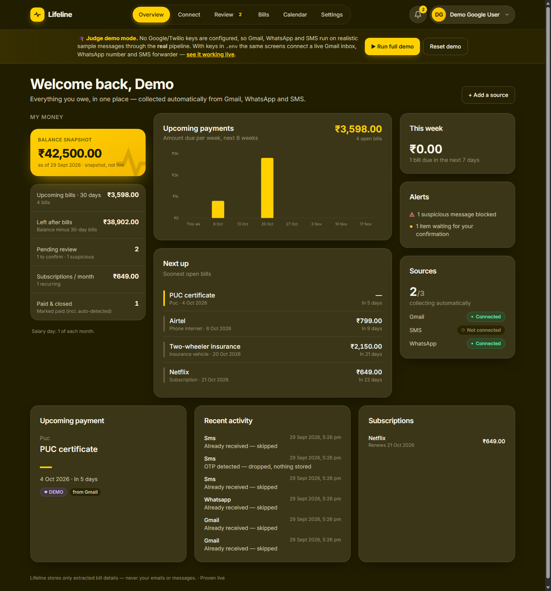
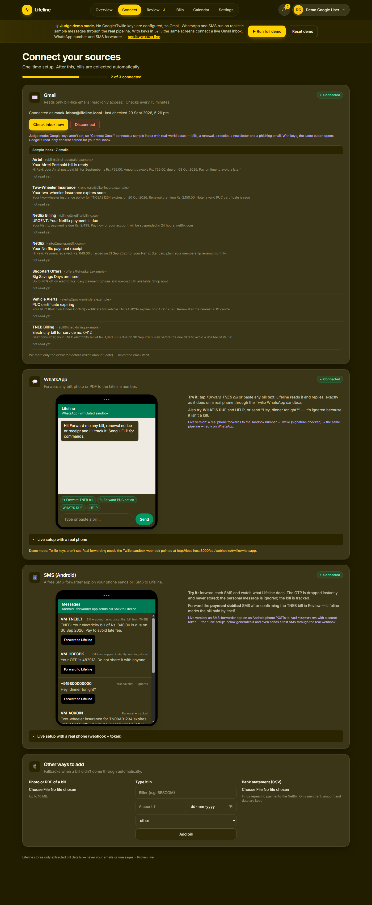
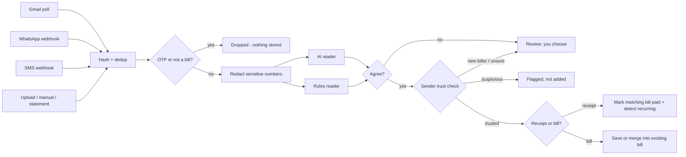

# Lifeline

**Track everything, miss nothing.** Lifeline collects your bills, renewals and dues from **Gmail, WhatsApp and SMS** automatically, checks the sender is genuine, blocks fake and phishing bills, and shows everything that needs you in one place.

> Uproot Innovation Hackathon, Problem 3: *Fragmented Life Administration & Obligation Fatigue*



---

## ▶ Run it (judges: one command)

**Needs:** Python 3.10 or newer. Node, accounts and API keys are **not** needed.

| OS | Command |
|---|---|
| **Windows** | Double-click **`start.bat`** (or run it in a terminal) |
| **macOS / Linux** | `./start.sh` |

The first run creates a private Python environment and installs dependencies (1–3 minutes). Then it opens **http://localhost:8000**.

**Then:**
1. Click **🎓 Enter judge demo**. No sign-up is needed.
2. Click **▶ Run full demo** in the gold banner. It connects a sample Gmail inbox, forwards a bill on WhatsApp, and sends SMS (a bill, an OTP, and a message the two readers disagree on).
3. Open **Review** and confirm the TNEB bill. It arrived through **three channels** but is shown **once**.
4. On **Connect → SMS**, forward the **payment debited** SMS. The bill is **marked paid by itself**.
5. Open **Review → Suspicious** to see the fake "Netflix" email blocked, with the reasons.
6. **Reset demo** replays everything from scratch.

### Judge mode vs live mode

The GitHub copy runs in **judge mode**. There are no Google or Twilio keys, so every source runs on realistic sample messages, **through the same pipeline code** the live integrations use. With keys in `.env`, the same screens connect to a real Gmail inbox, a WhatsApp number and an Android SMS forwarder.

**We ran it live.** The in-app **"Proven live"** page lists what was verified against real services:
- real Google sign-in
- Gmail read-only consent (`gmail.readonly` only, checked with Google's tokeninfo)
- a real bill pulled from a real inbox
- the public HTTPS webhook

Screenshots go in `frontend/public/proof/`.

---

## What it does

| | Feature | How |
|---|---|---|
| ✉️ | **Gmail, fully automatic** | Google OAuth (read-only). Only bill-like mail is searched and downloaded, then polled every 15 min. |
| 💬 | **WhatsApp** | Forward any bill (text, photo or PDF) to the Twilio sandbox number. Signature-checked webhook, instant reply. `WHAT'S DUE` and `HELP` commands. |
| 📱 | **SMS (Android)** | A free SMS-forwarder app POSTs bill SMS to a token-protected webhook. OTPs are dropped on the phone *and* on the server. |
| 📎 | **Fallbacks** | Photo/PDF upload, manual entry, and bank-statement CSV (finds recurring charges like Netflix). |
| 🛡️ | **Fake-bill detection** | Sender domain vs the official list, look-alike domains (`netf1ix`), SPF/DKIM/DMARC, link-text ≠ link-target, pressure wording, "company never asks for payment" rules, personal-mailbox senders, and a **cross-check with your own payment history**. |
| 🧠 | **Two independent readers** | An AI extractor and a rules extractor read every message. If they disagree on an amount or date, **you** choose; Lifeline never guesses. |
| 🔁 | **Dedup, paid detection, recurring** | The same bill arriving through several channels becomes one item. A "debited" SMS or receipt closes the matching bill. Monthly and annual renewals are detected. |
| 🔒 | **Privacy by design** | Raw messages are **never stored or logged**. Only the extracted biller, amount and date are kept. Card, account, Aadhaar, PAN and phone numbers are masked **before** any AI call. A test scans the database file to prove this. |
| 📊 | **Dashboard** | Overview (balance snapshot, 30-day bills, weekly payments chart, alerts), Review, Bills, Calendar, Settings. |



## How a message flows



Code: `backend/app/services/pipeline.py`. Every input takes this one path.

## Tech stack

- **Backend:** Python, FastAPI, SQLAlchemy (SQLite), APScheduler, httpx (Google OAuth + Gmail REST), Twilio SDK (webhook signatures), pdfplumber, dateparser, bcrypt + JWT, Fernet for encrypted OAuth tokens
- **AI:** An LLM with structured JSON output (optional; `requirements-live.txt`). Judge mode uses a deterministic mock extractor.
- **Frontend:** React, TypeScript, Vite, Tailwind CSS, TanStack Query. The built app is committed and served by the backend, so there is one URL.

## Tests

```bash
cd backend && .venv/Scripts/python -m pytest      # Windows
cd backend && .venv/bin/python -m pytest          # macOS / Linux
```

**73 tests** cover:
- OTP filter and redaction
- both extractors and reconcile
- trust scoring, including "a friend sends a fake bill from Gmail"
- dedup and cross-channel merge
- paid detection and recurring detection
- SMS and Twilio webhooks (bad token, bad signature)
- Gmail OAuth state and expiry
- upload limits
- the full judge demo
- a scan of the database file proving no message text is stored

## Going live (optional)

See **[docs/SETUP_HUMAN_STEPS.md](docs/SETUP_HUMAN_STEPS.md)** for the Google OAuth client, Gmail API, Twilio WhatsApp sandbox, ngrok, and the Android SMS forwarder. Copy `.env.example` to `.env`, fill in the keys, and run `start.bat` again.

## Troubleshooting

| Problem | Fix |
|---|---|
| `Python 3.10 or newer is required` | Install Python and tick **Add python.exe to PATH**. |
| Port 8000 already in use | Close the other app, or run `cd backend && .venv\Scripts\python -m uvicorn app.main:app --port 8001` and open that port. |
| Windows says an *Application Control policy has blocked* a file | `start.bat` handles this automatically by reinstalling SQLAlchemy as pure Python. |
| `pip` path-length error on Windows | Clone into a short folder such as `C:\lifeline`. |

## Repository layout

```
start.bat / start.sh      one-command launchers
backend/app/              FastAPI app: routers/, services/ (pipeline, trust, extraction, gmail, whatsapp, sms), llm/, data/
backend/tests/            73 tests
frontend/src/             React app: pages/ (Overview, Connect, Review, Bills, Calendar, Settings, Proof), judge mode, simulators
frontend/dist/            built web app, served at http://localhost:8000
docs/                     setup steps and screenshots
the product specification full product specification
```

## Status

- **Built:** the input side end to end (collect, understand, verify, dedupe, detect payments and subscriptions), plus the dashboard UI.
- **Next:** ₹-consequence ranking, the obligation graph (PUC → insurance), escalating reminders (push/WhatsApp), and the waiver-letter drafter. These are specified in the product specification.
