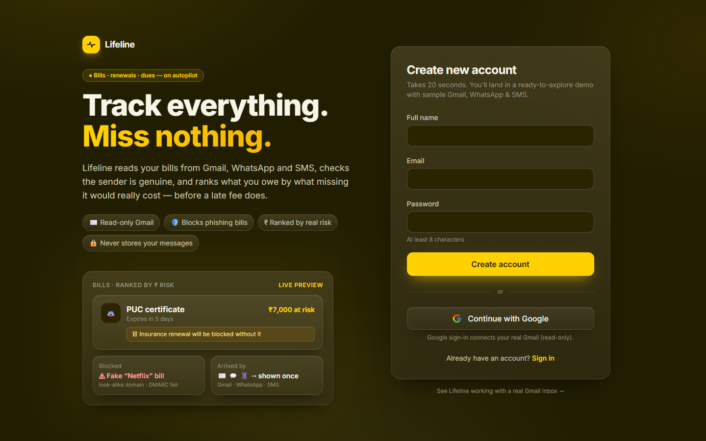
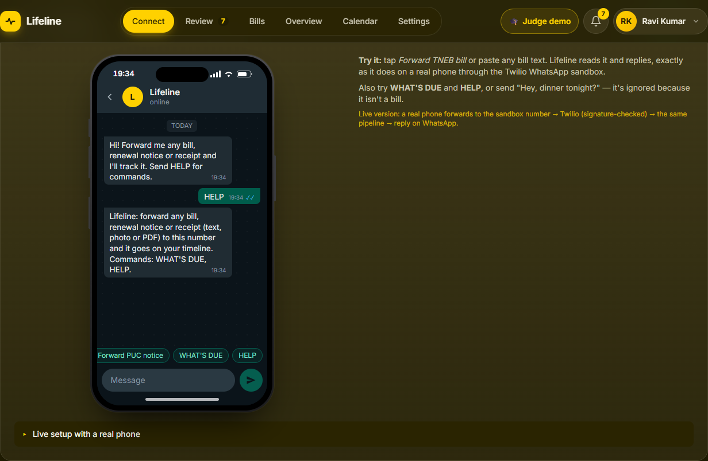
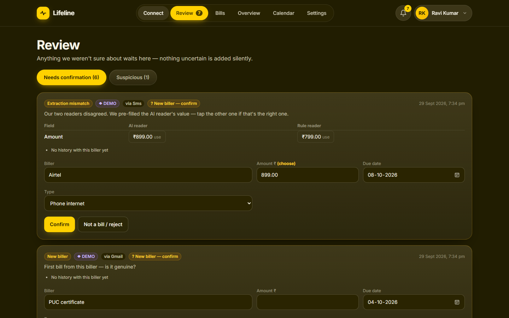
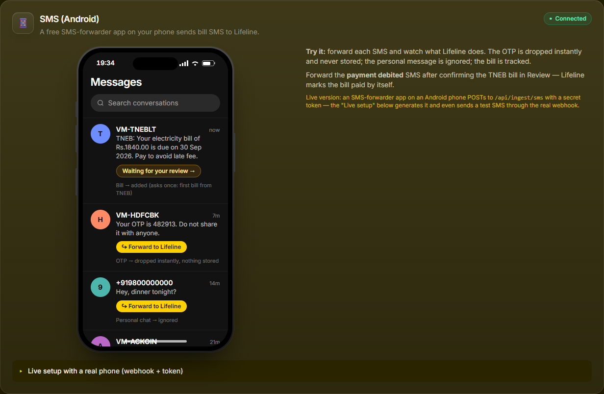
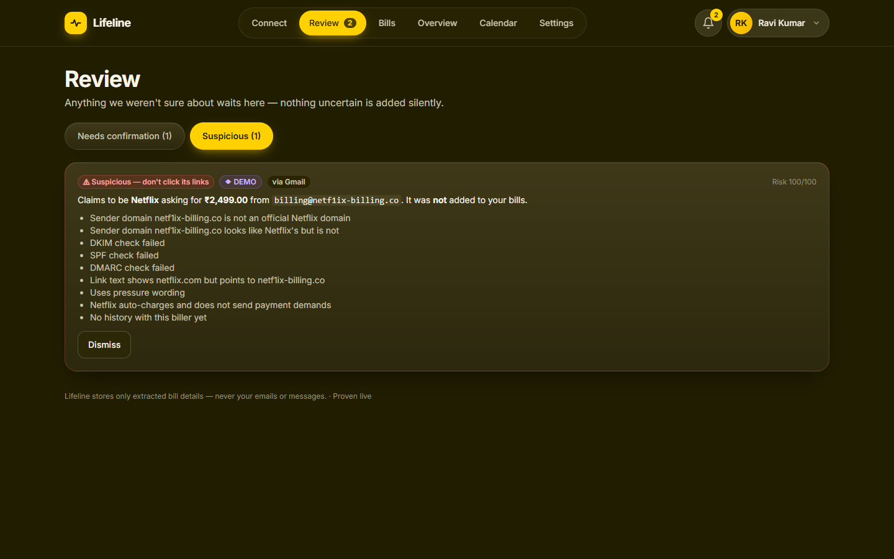
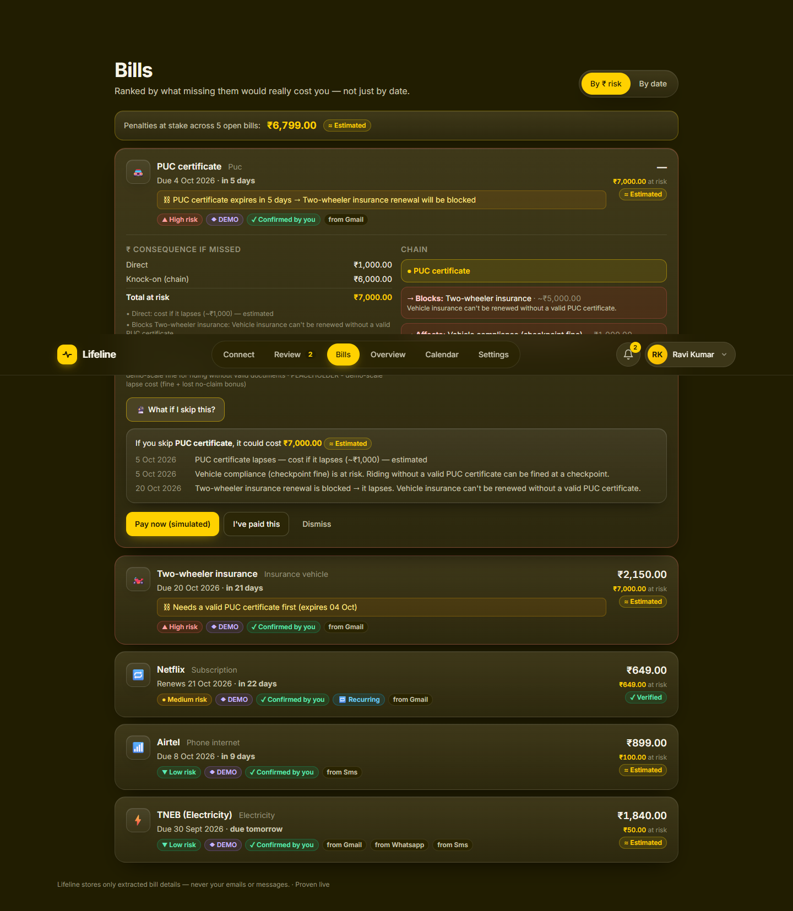
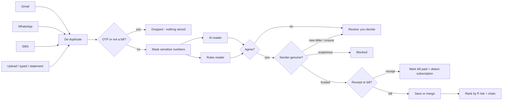

# Lifeline

### Track everything. Miss nothing.

**Live app → [lifeline-tau-ten.vercel.app](https://lifeline-tau-ten.vercel.app)**

Lifeline turns scattered bills, renewals and dues into one connected system. It collects them automatically from **Gmail, WhatsApp and SMS**, checks the sender is genuine, blocks fake and phishing bills, and ranks everything by **what missing it would really cost you** in rupees, not just by date.

> Uproot Innovation Hackathon, Problem 3: *Fragmented Life Administration & Obligation Fatigue: Track Everything, Miss Everything.*



---

## Try it in 2 minutes

1. Open **[lifeline-tau-ten.vercel.app](https://lifeline-tau-ten.vercel.app)** and fill in **Create new account** (any name, email and password). You land in a ready-to-explore **demo workspace** with sample Gmail, WhatsApp and SMS.
2. On **Connect**, open **🎓 Judge demo → ▶ Run full demo**. In about a minute Lifeline:
   - reads a sample Gmail inbox of 7 emails: bills, a renewal, a receipt, a newsletter and **a phishing email**
   - receives the same electricity bill forwarded on **WhatsApp**
   - receives it again by **SMS**, plus an **OTP** and a message its two readers disagree on

   You can also use the phones yourself.
3. **Review**: the electricity bill arrived through **three channels** but is shown **once**. Confirm it; amounts are pre-filled from what was detected.
4. **Connect → SMS phone**: the reviewed message has left the phone. Forward **"Rs.1840.00 debited…"** and Lifeline **marks the bill paid by itself**.
5. **Review → Suspicious**: the fake "Netflix" email is blocked, with the reasons (look-alike domain `netf1ix-billing.co`, DMARC fail, misleading link, pressure wording).
6. **Bills**, ranked by ₹ risk: the **PUC certificate is #1** even without an amount, because an expired PUC **blocks the bike-insurance renewal**. Open it for the chain, **🔮 What if I skip this?**, and **Pay now (simulated)**.
7. **Reminders**: press **⏩ Simulate next 7 days**. Low-risk bills get a nudge, while high-risk ones escalate to WhatsApp and finally a family member. Snooze or mark paid right there; paying stops everything.
8. **Cash flow** plans each payment around your salary day and balance. **Subscriptions** (from Bills) shows monthly and yearly cost and duplicate services.
9. On an overdue bill, **✍️ Penalty Fighter** drafts a polite late-fee waiver request from facts only.
10. **Overview** is your money dashboard, with a Life-load score. **Judge demo → Reset** replays everything.

| Connect: real-looking phones | Review: never guesses |
|---|---|
|  |  |
|  |  |



---

## What it does

| | Feature | How |
|---|---|---|
| ✉️ | **Gmail, fully automatic** | Google OAuth, **read-only** (`gmail.readonly`). Only bill-like mail is searched and downloaded, then polled every 15 minutes. |
| 💬 | **WhatsApp** | Forward any bill (text, photo or PDF) to the Lifeline number via the Twilio WhatsApp sandbox. Signature-checked webhook, instant reply, `WHAT'S DUE` / `HELP` commands. |
| 📱 | **SMS (Android)** | A free SMS-forwarder app posts bill SMS to a token-protected webhook. **OTPs are dropped** on the phone and on the server. |
| 📎 | **Fallbacks** | Photo/PDF upload, type it in, and bank-statement CSV (finds recurring charges like Netflix). |
| 🛡️ | **Fake-bill detection** | Sender domain vs. the official list, look-alike domains, SPF/DKIM/DMARC, link text ≠ link target, pressure wording, "this company never asks for payment" rules, personal-mailbox senders, and a **cross-check with your own payment history**. |
| 🧠 | **Two independent readers** | An AI reader and a rules reader read every message. If they disagree on an amount or date, **you** decide; Lifeline never silently picks. |
| 🔁 | **One bill, many channels** | The same bill arriving by email, WhatsApp and SMS becomes one item. A "debited" SMS or a receipt closes it automatically. Monthly and annual renewals are detected. |
| ₹ | **Ranked by real consequence** | Each bill's cost if missed = late fee or lapse cost + knock-on effects through the **obligation graph** (e.g. *PUC → blocks → vehicle insurance*). High / Medium / Low tiers; every number labelled **Verified** or **Estimated**. |
| 🔮 | **What-if & one-tap pay** | "What if I skip this?" shows the dated chain of effects. Pay is **simulated** (no real money moves) and never uses links from the message. |
| 🔔 | **Reminders that escalate with ₹ risk** | In-app → push → WhatsApp → family alert. Repeats every 3 h (max 3), respects quiet hours and WhatsApp's 24-hour window, and stops the moment a bill is paid. Reply **PAID**, **15** or **30** on WhatsApp. |
| 💸 | **Cash-flow planner** | Plans payments around salary day and balance, warns when salary arrives after a due date, and pays the highest penalty-per-rupee first. |
| ✍️ | **Penalty Fighter** | Drafts a late-fee waiver request from facts only (placeholders for anything unknown) and tracks whether it worked. |
| 🔁 | **Subscriptions & savings** | Monthly and yearly cost, price changes, duplicate services; Cancel/Downgrade open the official account page. |
| 🧮 | **Life-load score** | 0–100: how heavy your next 7 days are. |
| 🔒 | **Privacy by design** | Messages are **never stored or logged**; only the extracted biller, amount and date are kept. Card, account, Aadhaar, PAN and phone numbers are masked **before** any AI call. A test scans the database file to prove it. **Delete all my data** wipes everything. |

## Demo workspace vs. live mode

The hosted app runs **demo workspaces**: each new account gets realistic sample sources flowing through the **same pipeline code** the live integrations use. With API keys configured, the same screens connect to a real Gmail inbox, a real WhatsApp number (Twilio) and an Android SMS forwarder.

**Verified live by the team:**
- real Google sign-in
- Gmail read-only consent (Google granted exactly `gmail.readonly`)
- a real bill pulled from a real inbox and put in Review
- a public HTTPS webhook for WhatsApp and SMS

The in-app **Proven live** page explains how.

## How a message flows



Every input takes this one path: `backend/app/services/pipeline.py`.

## Tech stack

- **Backend:** Python, FastAPI, SQLAlchemy (Postgres in the cloud, SQLite locally), APScheduler, httpx (Google OAuth + Gmail REST), Twilio (webhook signatures), pdfplumber, dateparser, bcrypt + JWT, Fernet-encrypted OAuth tokens
- **AI:** LLM extraction with structured JSON output (optional, `backend/requirements-live.txt`); the demo uses a deterministic extractor
- **Frontend:** React, TypeScript, Vite, Tailwind CSS, TanStack Query
- **Hosting:** Vercel (static web app + Python serverless API)

## Quality

- **97 backend tests** cover:
  - OTP filter and redaction
  - both readers and the disagreement check
  - fake-bill scoring, including "a friend sends a fake bill from Gmail"
  - cross-channel merge, paid detection and subscription detection
  - ₹-risk ranking and the PUC → insurance chain
  - the reminder ladder, repeat cap, quiet hours, snooze, stop-on-paid and family alert
  - the cash-flow planner, Penalty Fighter and delete-all
  - webhook security (bad token, bad signature)
  - Gmail OAuth state and expiry
  - a database scan proving no message text is stored
- **End-to-end browser test** (`e2e/click_through.py`) clicks every button, from sign-up through reminders, cash flow, subscriptions, Penalty Fighter and family contacts to delete-all. **26/26 steps pass.**

```bash
cd backend && python -m pytest
```

## Run it yourself

Needs Python 3.10+. Run **`start.bat`** (Windows) or **`./start.sh`** (macOS/Linux). The script creates a private environment, installs everything and opens the app in your browser. To connect real accounts, copy `.env.example` to `.env` and follow **[docs/SETUP_HUMAN_STEPS.md](docs/SETUP_HUMAN_STEPS.md)**.

## Repository layout

```
api/index.py            Vercel entry point for the Python API
backend/app/            FastAPI app: routers/, services/ (pipeline, trust, extraction, risk, gmail, whatsapp, sms), llm/, data/
backend/tests/          97 tests
frontend/src/           React app: pages/, judge-mode simulators, design system
frontend/dist/          built web app
e2e/click_through.py    browser test of every button
docs/                   setup steps and screenshots
start.bat / start.sh    one-command local launchers
```

## Roadmap

- **Penalty figures:** seeded late fees and lapse costs are illustrative and always labelled **Estimated**. Sourced figures go in `backend/app/data/penalty_rules_seed.json`; the app refuses "Verified" without a real source.
- **Next:** real browser push (PWA), live bank balances (Account Aggregator), and bill payment through a licensed partner.
