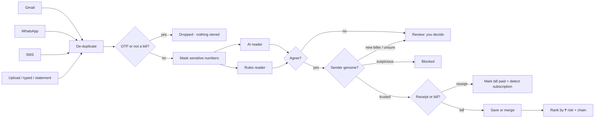

# Lifeline

### Track everything. Miss nothing.

**Live app → [lifeline-tau-ten.vercel.app](https://lifeline-tau-ten.vercel.app)**

Lifeline turns scattered bills, renewals and dues into one connected system. It collects them automatically from **Gmail, WhatsApp and SMS**, checks the sender is genuine, blocks fake and phishing bills, and ranks everything by **what missing it would really cost you** in rupees, not just by date.

> Uproot Innovation Hackathon, Problem 3: *Fragmented Life Administration & Obligation Fatigue: Track Everything, Miss Everything.*


---

## Get started

1. Open **[lifeline-tau-ten.vercel.app](https://lifeline-tau-ten.vercel.app)** and **Create new account**. Your account is real, and you land on **Connect**.
2. **Gmail:** press **Connect Gmail** and allow **read-only** access on Google's screen. Lifeline reads the last two weeks of bill-like mail, then checks for new mail whenever you open the app (and once a day on its own).
3. **WhatsApp:** save your number, send the join code to the Lifeline WhatsApp number once, then forward any bill (text, photo or PDF). Lifeline replies instantly; send `WHAT'S DUE` or ask a question ending in `?`.
4. **SMS (Android):** create your private SMS token on Connect and paste it, with the webhook address shown there, into a free SMS-forwarder app. Bill SMS arrive automatically; OTPs are dropped.
5. **Review** anything Lifeline wasn't sure about (a new biller, two readers disagreeing, a suspicious sender). Everything else goes straight to **Bills**, ranked by what missing it would cost you.
6. Add your balance and salary day in **Settings** to unlock **Cash flow**, and turn on **notifications** for reminders.

> While the Google app is in testing, Google only lets the Gmail accounts added as test users connect, and asks them to reconnect about once a week.

| Connect: real-looking phones | Review: never guesses |
|---|---|
|  |  |
|  |  |


---

## What it does

| | Feature | How |
|---|---|---|
| ✉️ | **Gmail, fully automatic** | Google OAuth, **read-only** (`gmail.readonly`). Only bill-like mail is searched and downloaded, then polled every 15 minutes. |
| 💬 | **WhatsApp** | Forward any bill (text, photo or PDF) to the Lifeline number via the Twilio WhatsApp sandbox. Signature-checked webhook, instant reply, `WHAT'S DUE` / `HELP` commands. |
| 📱 | **SMS (Android)** | A free SMS-forwarder app posts bill SMS to a token-protected webhook. **OTPs are dropped** on the phone and on the server. |
| 📎 | **Fallbacks** | Photo/PDF upload, type it in, and bank-statement CSV (finds recurring charges like Netflix). |
| 🛡️ | **Fake-bill detection** | Sender domain vs. the official list, look-alike domains, SPF/DKIM/DMARC, link text ≠ link target, pressure wording, "this company never asks for payment" rules, personal-mailbox senders, and a **cross-check with your own payment history**. |
| 🧠 | **Two independent readers** | An AI reader and a rules reader read every message. If they disagree on an amount or date, **you** decide; Lifeline never silently picks. |
| 🔁 | **One bill, many channels** | The same bill arriving by email, WhatsApp and SMS becomes one item. A "debited" SMS or a receipt closes it automatically. Monthly and annual renewals are detected. |
| ₹ | **Ranked by real consequence** | Each bill's cost if missed = late fee or lapse cost + knock-on effects through the **obligation graph** (e.g. *PUC → blocks → vehicle insurance*). High / Medium / Low tiers; every number labelled **Verified** or **Estimated**. |
| 🔮 | **What-if & one-tap pay** | "What if I skip this?" shows the dated chain of effects. Pay is **simulated** (no real money moves) and never uses links from the message. |
| 🔔 | **Reminders that escalate with ₹ risk** | In-app → push → WhatsApp → family alert. Repeats every 3 h (max 3), respects quiet hours and WhatsApp's 24-hour window, and stops the moment a bill is paid. Reply **PAID**, **15** or **30** on WhatsApp. |
| 💸 | **Cash-flow planner** | Plans payments around salary day and balance, warns when salary arrives after a due date, and pays the highest penalty-per-rupee first. |
| ✍️ | **Penalty Fighter** | Drafts a late-fee waiver request from facts only (placeholders for anything unknown) and tracks whether it worked. |
| 🔁 | **Subscriptions & savings** | Monthly and yearly cost, price changes, duplicate services; Cancel/Downgrade open the official account page. |
| ⚡ | **AutoPay warning + "Still using it?"** | A bank's pre-debit SMS ("Rs.649 will be debited… AutoPay e-mandate") is read as the *next* automatic charge, not a payment. Lifeline warns you before it charges, asks if you still use it, and totals what you'd save a year by cancelling the ones you don't. |
| ⚠️ | **Bill-shock alert** | A bill much higher than what you usually pay that biller (≥25% above your median) is flagged with the extra amount and a mini chart of your recent bills, on Bills and in the reminder itself. |
| 🧮 | **Life-load score** | 0–100: how heavy your next 7 days are. |
| 💬 | **Ask Lifeline** | Questions about your bills answered from your own data, with exact numbers, in the app and on WhatsApp. |
| 📁 | **Documents vault** | PUC, insurance, licence, RC, passport expiry dates (only the last 4 characters of the number). Each becomes a tracked renewal, so the PUC → insurance chain works. |
| 👥 | **Split bills** | Equal shares with flatmates or family, a WhatsApp reminder to each person, and mark paid. |
| 📊 | **Monthly report** | Penalties avoided, bills paid on time, auto-detected payments, next month's load; print or save as PDF. |
| 🗣️ | **Hindi & Tamil bills** | Regional-language bill SMS understood (amount, date, type); Hindi OTPs dropped. |
| 📷 | **Photo bills, read on your device** | Bill photos are OCR'd in the browser; only the text is sent, then masked. |
| 🔔 | **Real push notifications** | Installable web app (PWA) with web push for reminders; enable in Settings. |
| 🔒 | **Privacy by design** | Messages are **never stored or logged**; only the extracted biller, amount and date are kept. Card, account, Aadhaar, PAN and phone numbers are masked **before** any AI call. A test scans the database file to prove it. **Delete all my data** wipes everything. |

## Real connections

Every account connects the user's own sources: their Gmail inbox (Google OAuth, `gmail.readonly` only), their WhatsApp number (Twilio, signature-checked webhook) and their phone's SMS (an Android forwarder posting to a token-protected webhook). A Vercel Cron job checks connected inboxes and runs the reminder engine daily, and the app refreshes them whenever it is opened.

A sample-data **demo workspace** (sample Gmail inbox, WhatsApp and SMS phone simulators, one-click full demo) is still built in and powers the automated browser test.

**Verified live by the team:**
- real Google sign-in
- Gmail read-only consent (Google granted exactly `gmail.readonly`)
- a real bill pulled from a real inbox and put in Review
- a public HTTPS webhook for WhatsApp and SMS

The in-app **Proven live** page explains how.

## How a message flows



Every input takes this one path: `backend/app/services/pipeline.py`.

## Tech stack

- **Backend:** Python, FastAPI, SQLAlchemy (Postgres in the cloud, SQLite locally), APScheduler, httpx (Google OAuth + Gmail REST), Twilio (webhook signatures), pdfplumber, dateparser, bcrypt + JWT, Fernet-encrypted OAuth tokens
- **AI:** LLM extraction with structured JSON output (optional, `backend/requirements-live.txt`); the demo uses a deterministic extractor
- **Frontend:** React, TypeScript, Vite, Tailwind CSS, TanStack Query
- **Hosting:** Vercel (static web app + Python serverless API)

## Quality

- **114 backend tests** cover:
  - OTP filter and redaction
  - both readers and the disagreement check
  - fake-bill scoring, including "a friend sends a fake bill from Gmail"
  - cross-channel merge, paid detection and subscription detection
  - ₹-risk ranking and the PUC → insurance chain
  - the reminder ladder, repeat cap, quiet hours, snooze, stop-on-paid and family alert
  - the cash-flow planner, Penalty Fighter and delete-all
  - Ask Lifeline intents, documents, splits, the monthly report, Hindi/Tamil bills and push
  - AutoPay pre-debit detection, "Still using it?" savings and the bill-shock alert
  - webhook security (bad token, bad signature)
  - Gmail OAuth state and expiry
  - a database scan proving no message text is stored
- **End-to-end browser test** (`e2e/click_through.py`) clicks every button, from a real sign-up (connect your own Gmail) through the demo workspace's reminders, cash flow, subscriptions, Penalty Fighter, bill splits, documents, the report, Ask Lifeline, photo OCR, AutoPay, bill shock and notifications to delete-all. **36/36 steps pass.**

```bash
cd backend && python -m pytest
```

## Run it yourself

Needs Python 3.10+. Run **`start.bat`** (Windows) or **`./start.sh`** (macOS/Linux). The script creates a private environment, installs everything and opens the app in your browser. To connect real accounts, copy `.env.example` to `.env` and follow **[docs/SETUP_HUMAN_STEPS.md](docs/SETUP_HUMAN_STEPS.md)**.

## Repository layout

```
api/index.py            Vercel entry point for the Python API
backend/app/            FastAPI app: routers/, services/ (pipeline, trust, extraction, risk, gmail, whatsapp, sms), llm/, data/
backend/tests/          114 tests
frontend/src/           React app: pages/, judge-mode simulators, design system
frontend/dist/          built web app
e2e/click_through.py    browser test of every button
docs/                   setup steps and screenshots
start.bat / start.sh    one-command local launchers
```

## Roadmap

- **Penalty figures:** seeded late fees and lapse costs are illustrative and always labelled **Estimated**. Sourced figures go in `backend/app/data/penalty_rules_seed.json`; the app refuses "Verified" without a real source.
- **Next:** live bank balances (Account Aggregator), bill payment through a licensed partner (BBPS/UPI, the commission model), and a verified Google app so any Gmail user can connect.
